# TakeShape Starter Auth0 + Shopify

The following is a guide to launch a Next.JS project that uses Auth0 for authentication, Shopify and Recharge for purchasing products, and TakeShape to store custom user profile information and generate an easy-to-use, user-scoped e-commerce GraphQL API.

This is a [Next.js](https://nextjs.org/) project bootstrapped with [`create-next-app`](https://github.com/vercel/next.js/tree/canary/packages/create-next-app).

## Screenshot

## Instructions

### Auth0

1. Create an Auth0 account, if you haven't already at [auth0.com](https://auth0.com/).

2. Create an Auth0 application by going to the `Applications` page under the `Applications` tab on the left.

   - Choose to create a `Single Page Web Application`.
   - Skip the `Quick Start`, and go directly to the `Settings`.
   - Take note of your `domain`, you'll need it later. It typically looks like this: `dev-by9w1mxg.us.auth0.com`.
   - Scroll down, and fill in the following fields:
     - Allowed Callback URLs: http://localhost:3000/
     - Allowed Logout URLs: http://localhost:3000/
     - Allowed Web Origins: http://localhost:3000/
     - Allowed Origins (CORS): http://localhost:3000/
   - Now go to the `Advanced Settings` section, select the `Grant Types` tab, and verify that `Authorization Code`, `Implicit` and `Refresh Token` are all selected.
   - Scroll down to the very bottom of page and click **Save Changes**; the application doesn't automatically save
     itself!

3. Create a TakeShape project using the pattern in this repo. This button will deploy the project for you:

   - 

4. With your project imported, you should see an Auth0 and a Shopify service on the dashboard.

   - Click on the Auth0 service.
   - Type in your Auth0 `domain` from the earlier step.
   - Take note of the `audience` from the TakeShape config screen, you'll need it later.
   - Save the service.

5. Set up your TakeShape API Key for making public queries. You'll need to use this for getting a list of products
   available to purchase.

   - Go to the `Settings` tab, then to `API Keys`.
   - Create a new API Key, name it whatever you like, `starter` would be fine.
   - Give it the `anonymous` role.
   - Copy the key and save it somewhere. This is the only time you'll see it.

6. Now go back to your Auth0 account where you'll create an API for your application.

   - Go to `Applications → APIs` and click **Create API**.
   - Set the `identifier` to the `audience` you encountered earlier on the TakeShape Auth0 Service page.
   - Leave the signing algorithm as `RS256`.
   - From the **Settings** tab, scroll down to **Access Settings** and turn on **Allow Offline Access** — this will allow your project to generate refresh tokens and then refresh user tokens when they expire.
   - **Save** the API.

### Shopify

> For the purposes of this starter it's assumed you are using Shopify in Test Mode, and using appropriately scoped API keys. Please do not run the demo on a live account as you may incur unexpected charges from Shopify.

1. [Create a Shopify store if you don't already have one](https://www.shopify.com/).

2. Navigate to your store's admin site by visiting `https://your-store.myshopify.com/admin`

3. Get your API keys.

   - Go to Apps → Develop Apps as shown in the image below

   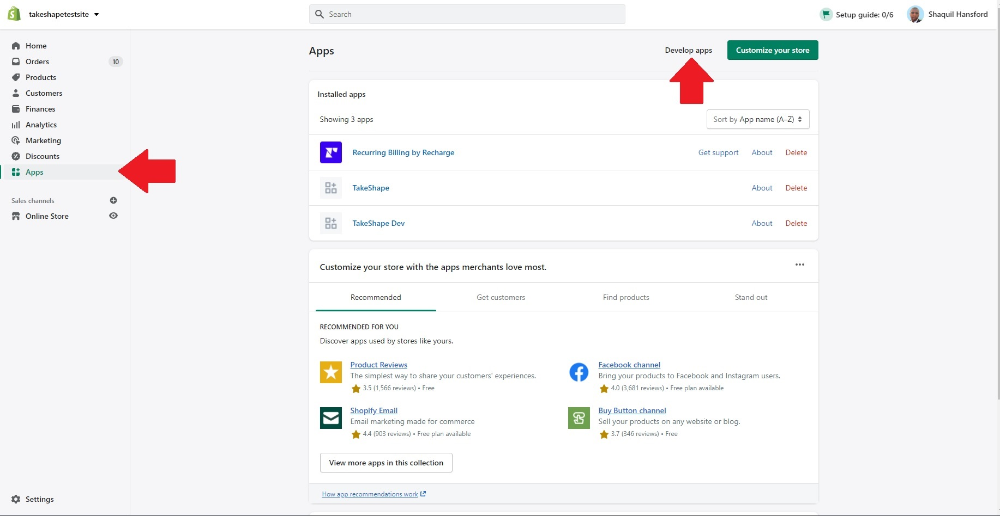

   - Select the "Create an App" button, then name it whatever you'd like in the popup modal that you'll see next. "NextJS Example" would be fine.

   - You'll be taken to your app's settings page. Under the Overview tab, you'll see "Select your app scopes to get started." Select "Configure Storefront API scopes".

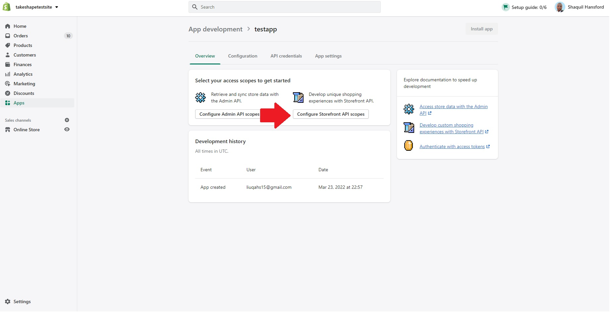

   - Enable the following:
      - `unauthenticated_write_checkouts`
      - `unauthenticated_read_checkouts`
      - `unauthenticated_read_customers`
      - `unauthenticated_write_customers`
      - `unauthenticated_read_product_listings`
      - `unauthenticated_read_selling_plans`
      
   Then hit Save in the top right.

   - Now select the API credentials tab. You'll see an "Install app" button. Select it and select the "Install app" above button it, and "Install" on the modal that pops up.

   - You'll be returned to your app's settings page, where you can select the "API Credentials" tab. You will now have a "Storefront API access token". Copy it and save it. You'll need it to configure Shopify Storefront in your TakeShape project.

   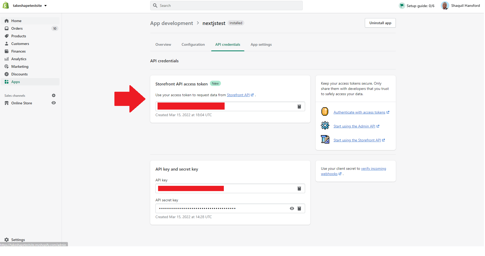

4. Setup test payments in your store.
##### Setting up test payments
   - Select "Settings" at the bottom-left of your store's admin page. On the new page that appears, select "Payments" in the navigation on the left.

   - In the Shopify Payments section, you'll see Shopify Payments. Complete the steps to activate it, then select "Manage".
   
   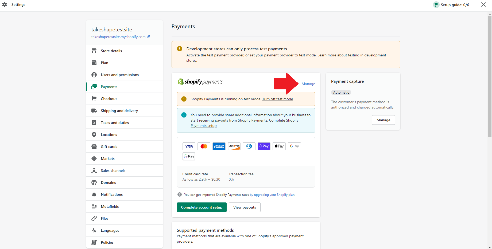

   - Scroll to the bottom of the next page and check the "Enable test mode" checkbox.

   - Select "Save" at the bottom-right of the page.

5. Configure your store's checkout. All of the following instructions require you to navigate to the settings of your store's admin page. In the navbar on the left, select Checkout.

   - Enable optional customer accounts for checkouts.
      
      - Under the "Customer accounts" section of the Checkout page, select "Accounts are optional".

      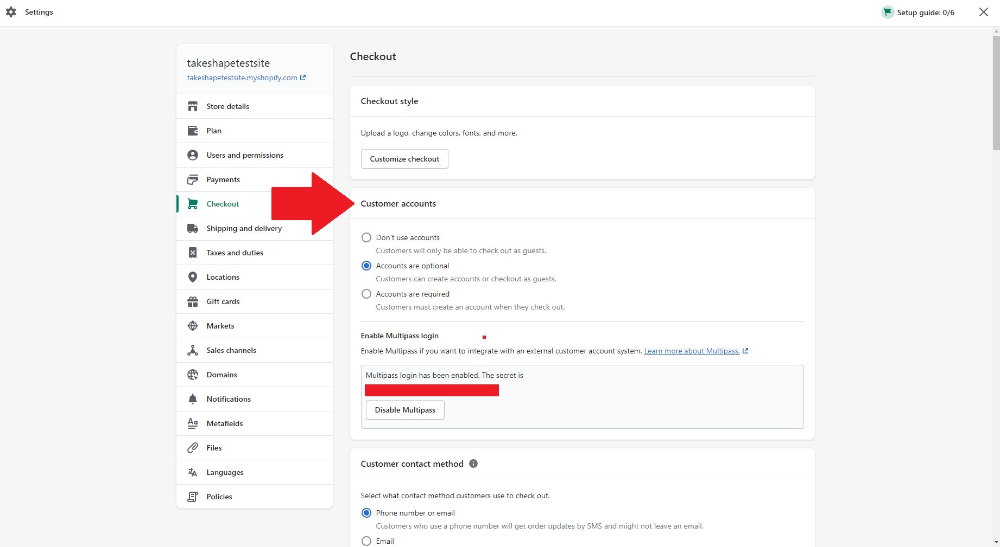

   - Set up your store to redirect users to `http://localhost:3000/purchases` after they finish a checkout.
      
      - In the Checkout page of your store's settings, scroll down to the section labeled "Order status page scripts".

      - Enter `` into the "Scripts" textbox.

      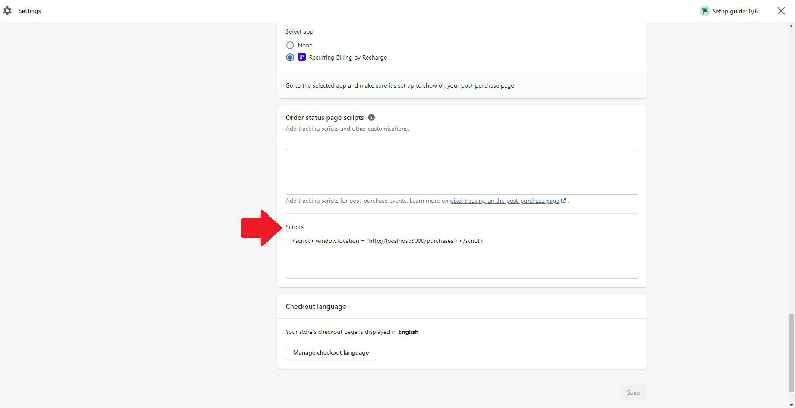

6. Configure your store in TakeShape

   - Set up your Shopify Storefront service.
      - Select **Shopify Storefront** from the list of services in the `API` tab, in the `Patterns & Services` pane.
      - Under **Endpoint**, enter your storefront api endpoint. It should look like `https://your-store.myshopify.com/api/2022-01/graphql.json`
      - Under **Authentication**, Enter `X-Shopify-Storefront-Access-Token` into  the Header field, and your Storefront access token into the Token field.
      - **Save** the service.
      
   - Set up your Shopify Admin service.
      - Select **Shopify Admin** from the list of services on the `API` tab, in the `Patterns & Services` pane.
      - Under **myshopify.com URL**, Enter your store's myshopify.com domain, which will look like `https://your-store.myshopify.com`
      - **Save** the service.
      - Select the "Update Schema" button at the bottom-right of the next dialog that appears.
      - Select the "Skip" button at the bottom-right of the dialog that appears asking you to import data, queries and mutations.

### Recharge

> NOTE: To add Recharge to your store, you must have payments properly configured in your settings. We encourage you to use Shopify Payments in test mode. Follow [the instructions from earlier in this readme](#setting-up-test-payments) to do so now.

Now add Recharge your Shopify store, then configure the Recharge service in your TakeShape project.

1. To add Recharge to your shop, navigate to Recharge Subscriptions in the shopify app store: https://apps.shopify.com/subscription-payments

   - Select the "Add app" button to install it to your shopify store.

2. Configure your products to offer subscriptions through Recharge.

   - Navigate to your store's admin page by visiting your store's myshopify domain and adding /admin to the end of the url. It should look like this: `https://your-store.myshopify.com/admin`.

   - Select "Apps" in the navbar on the left, then click on Recharge in the installed apps list.

   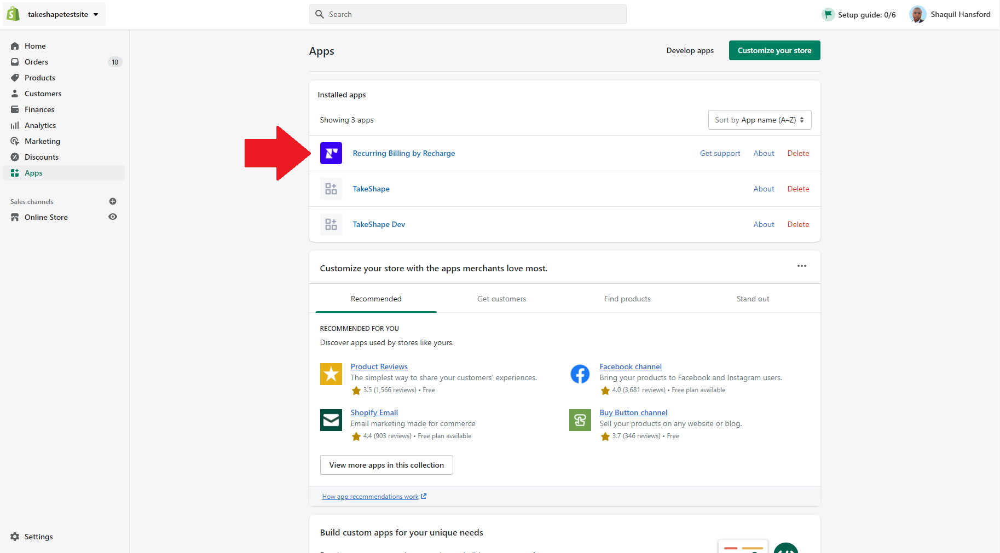

   - If Recharge sends you to an error page with the message "Sorry, Shopify says your store is ineligible for subscriptions", that means you haven't configured shopify payments for your store yet. Do so by following [the instructions above](#setting-up-test-payments). You can also follow [Recharge's instructions here](https://support.rechargepayments.com/hc/en-us/articles/360056542474-Shopify-Checkout-Integration-FAQ#h_01EV7H6EQQBTFM78E63RA03R13).

   - If you were redirected to Recharge, navigate to "Products" by selecting "Products" in the navbar at the top, then selecting "Products" in the dropdown.

   - Select "Add products" on the top-right of the products page.

   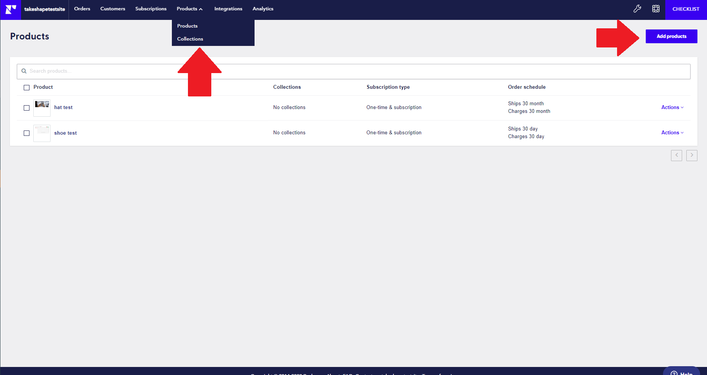

   - Select the products you would like to add subscriptions for, then configure the subscription type as "One-time and subscription". Configure the rest of the product as you'd like, then hit Save.
      - For the purposes of this starter, DO NOT set the product to "Subscription only" or "Pre-paid subscription only".

   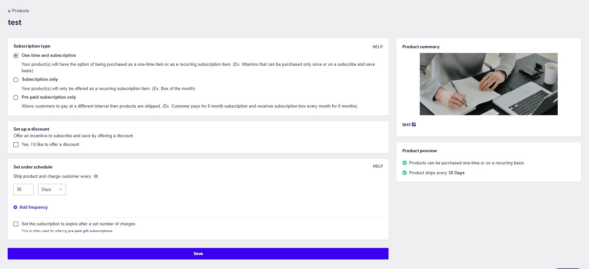

3. Configure your Recharge account's permissions to enable API access.

   - In your Recharge dashboard, navigate to the Accounts page in the Settings by hovering over the wrench icon and selecting "Accounts".

   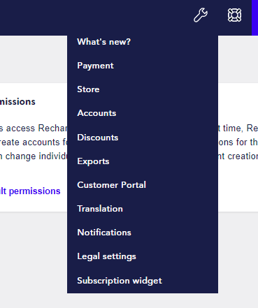

   - On this page, select "Edit store defaults" and check all boxes on the Store default permissions page. When done, select "Update store default permissions".

   - Navigate to "Integrations" in the navbar at the top, then select "API Tokens" at the top-right.

   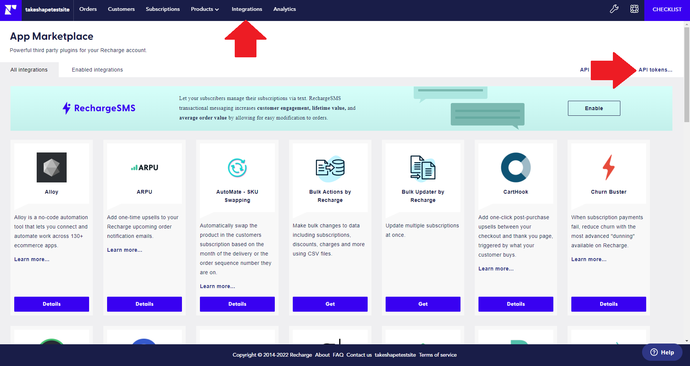

   - Select "Create an API Token", then configure the token with an appropriate name and email. Grant "Read and Write access" to all permissions.

   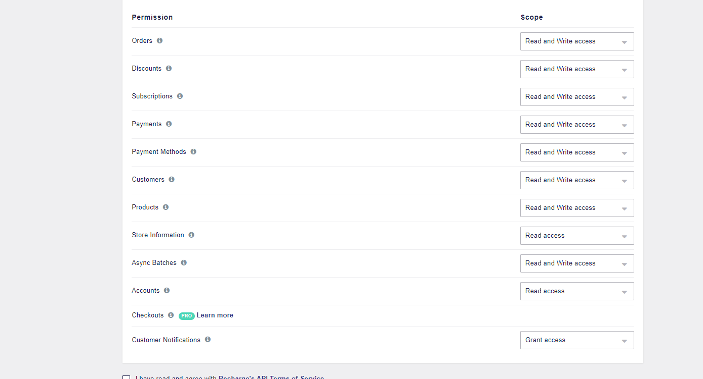

   - You’ll be taken back to the API tokens page where you’ll see your API key. Save it. It should look like: `sk_1x1_abcd123357e5d85ab72250e3116d8a4b1c429ba3cde9a872c827c8ad1f71901d`

4. Configure Recharge in your TakeShape Project.

   - Set up your Recharge service.
      - Select **Recharge** from the list of services in the `API` tab, in the `Patterns & Services` pane.
      - Under **Authentication**, Enter `X-Recharge-Access-Token` into the Header field, and your Recharge access token into the Token field.
      - **Save** the service.
### Running the Starter

1. Head over to your trusty terminal or tool of choice.

   - Clone this repo with `git clone https://github.com/takeshape/takeshape-starter-auth0-shopify`.
   - `cd` into the folder that the cloning created.
   - Run `mv .env.local-example .env.local` to rename the environment variables file.
   - Run `npm install`.

2. Follow the instructions in `.env.local`.

   - Some of the data you enter will be from Auth0, some will be from your TakeShape project

3. Run `npm run dev` to start the application and open [http://localhost:3000](http://localhost:3000) with your browser
   to play around!

4. First, login using a valid Auth0 or third-party account. You can also sign up for a new account.

5. Go to the homepage, select a product and payment terms then add it to your cart.

6. Click the Cart icon in the top nav. Review your cart, then click `Checkout Now`.

7. On the Shopify Checkout page, use one of the [Shopify test credit card numbers](https://help.shopify.com/en/manual/payments/shopify-payments/testing-shopify-payments#simulate-successful-transactions).
   `4242 4242 4242 4242` is commonly used, and will allow you to complete a successful purchase with no secondary authentication.

8. Upon a successful purchase you should be directed back to your dev site.

9. Try canceling a subscription from your **Purchases** page.

10. Play around, update your profile, create more users, more purchases. Try products with multiple prices...

### Known Limitations

- Due to limitations in the way Recharge interacts with Shopify, products configured for "Subscription only" in Recharge may not be rendered on the product page of this starter. We will address this in future updates to this codebase.

## Learn More

To learn more about Next.js, take a look at the following resources:

- [Next.js Documentation](https://nextjs.org/docs) - learn about Next.js features and API.
- [Learn Next.js](https://nextjs.org/learn) - an interactive Next.js tutorial.

You can check out [the Next.js GitHub repository](https://github.com/vercel/next.js/) - your feedback and contributions
are welcome!
